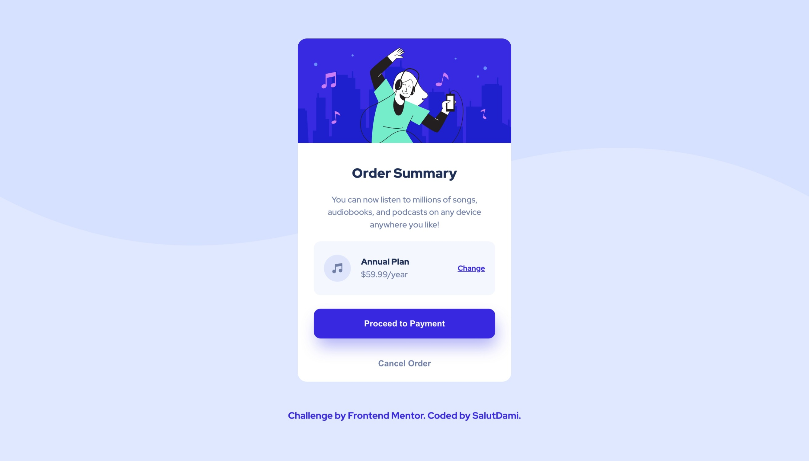

# Frontend Mentor - Order summary card solution

This is a solution to the [Order summary card challenge on Frontend Mentor](https://www.frontendmentor.io/challenges/order-summary-component-QlPmajDUj). Frontend Mentor challenges help you improve your coding skills by building realistic projects.

## Table of contents

- [Overview](#overview)
  - [The challenge](#the-challenge)
  - [Screenshot](#screenshot)
  - [Links](#links)
- [My process](#my-process)
  - [Built with](#built-with)
  - [Author](#author)

## Overview

### The challenge

The users will be able to:

- See hover states for interactive elements

### Screenshot

_A desktop view of the orderm summary card_

- A desktop view of the orderm summary card\*

### Links

- Solution URL: [Add solution URL here](https://github.com/salutDami/order-summary-component)
- Live Site URL: [Add live site URL here](https://salutdami.github.io/order-summary-component/)

## My process

### Built with

- Semantic HTML5 markup
- CSS custom properties
- CSS Math Functions
- Flexbox
- Mobile-first workflow

## Author

- Twitter - [@\_salutDami](https://www.twitter.com/_salutDami)
- Linkedin- [Ikuomola Stephen](https://www.linkedin.com/in/ikuomola-stephen/)
- Frontend Mentor - [@salutDami](https://www.frontendmentor.io/profile/salutDami)
